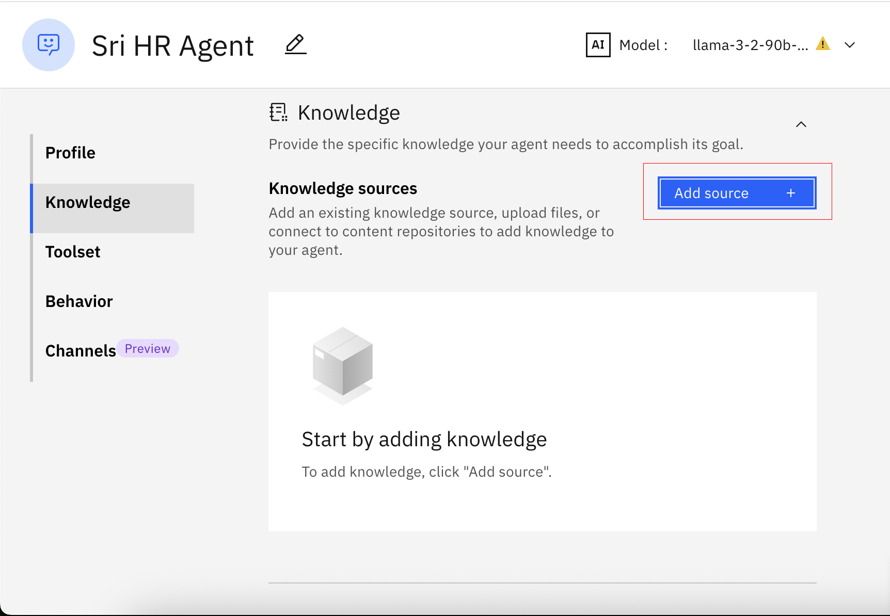
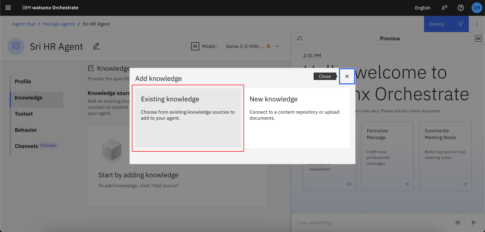
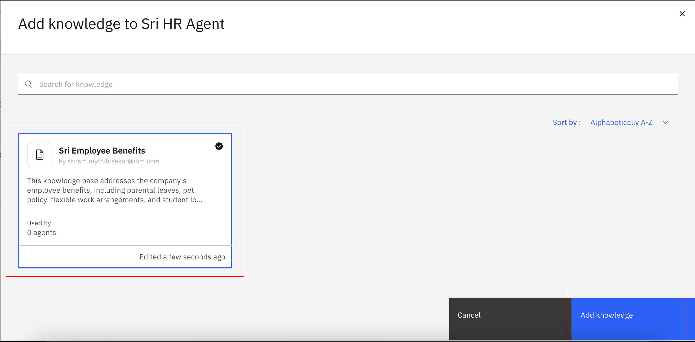

# 🧑‍💼 AskHR Lab 2: Building a RAG agent

Please refer to [Lab 2 Explanations](./pdfs/Lab%202-explanation.pdf) before starting.
    
In this lab, we will enable our HR agent in watsonx Orchestrate to answer questions based on a knowledge base. This agent retrieves relevant information from documents to answer user queries.

We will make this agent more powerful with more tools and access to APIs, and enable it to collaborate with other agents in lab3.


## Step by step instructions to build the HR Agent:

1. When you launch watsonx Orchestrate, you'll be directed to this page. Click on the hamburger menu in the top left corner:

    

1. Click on the down arrow next to **Build**.  Then click on **Agent Builder**:

    

1. Click on **Create agent +**:

    

1. Select "Create from scratch", give your agent a unique name (make sure to identify yourself by your initials or name, since this is a shared instance), e.g. "[Your Initial]_HR Agent", and fill in the description as shown below: 

    ```
    You are an agent who handles employee HR queries.  You provide short and crisp responses, keeping the output to 200 words or less. You can answer general questions about company benefits.
    ```  

    Click on **Create**:

    

1. We are going to build a knowledge base for the agent. Scroll down the screen to the **Knowledge** section and click on "Add source".

    

1. Choose "Existing Knowledge".

    

1. Search "Sri Employee Benefits" and click on the tab then click **Add knowledge**:

    


1. Scroll down to the **Behavior** section. Insert the instructions below into the **Instructions** field:

    ```
    Use your knowledge base to answer general questions about employee benefits. 
    ```

    

1. Test your agent in the preview chat on the right side by asking the following questions and validating the responses.  They should look similar to what is shown in the screenshot(s) below:

    ```
    What is the pet policy? 
    ```

    

1. You can try the following sample questions as well:

    ```
    how many days of leave am i entitled to?
    ```
    ```
    can i work from home 3 times a week?
    ```
    ```
    does the company provide any assistance on loan repayments?
    ```
    Notice that you get a generic answers based on policy for all employees. You will see in the next lab how you can connect it to Employee Address Agent and Leave Management Agent from Lab 1 to do tasks for you.

**Congratulations! You've built your RAG Agent.**
